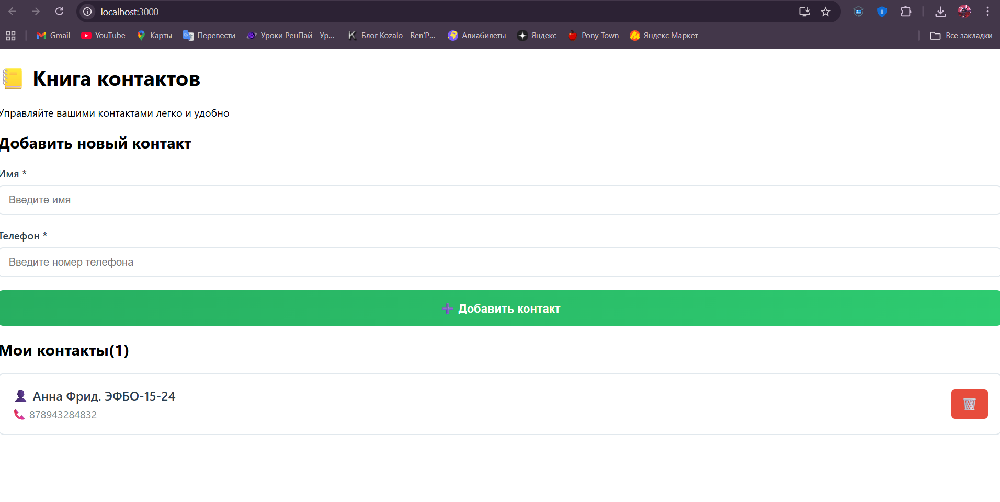

# 📒 Книга контактов

React-приложение для управления контактами

## Что сделано

- ✅ Добавление контактов (имя и телефон)
- ✅ Просмотр списка контактов  
- ✅ Удаление контактов
- ✅ Сохранение в LocalStorage
- ✅ Валидация полей

## Технологии

- React
- CSS
- LocalStorage

## Как запустить

```bash
npm start
```

## Скриншоты



## Студент

Фрид Анна  
ЭФБО-15-24

---

*Контрольная работа №4 по Технологиям индустриального программирования*
